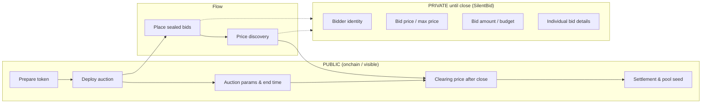

# SilentBid

**Privacy-focused fork of Uniswap's Continuous Clearing Auction (CCA) with sealed-bid configuration.** Bids stay private until the auction closes; settlement and liquidity bootstrapping follow the same flow as CCA.

**Contract & scripts:** [Silentbid-scripts](https://github.com/ayushsingh82/Silentbid-scripts) — deploy CCA, deploy SilentBid wrappers, submit bids, check status, and CRE finalize.

---

## What we built

SilentBid is a full-stack app for running sealed-bid CCA auctions on Sepolia. The flow:

1. **Create auction** — Deploy a CCA auction (or use an existing one), then deploy a SilentBid wrapper via `SilentBidFactory.deploySilentBid(auction)`. Only a commitment is stored onchain; bid details stay offchain.
2. **Place sealed bid** — User signs an EIP-712 bid (maxPrice, amount, auctionId) in the wallet. The frontend sends the signed payload to `POST /api/cre/bid`; the API verifies the signature, computes the commitment, and stores the bid. The frontend then calls `BlindPoolCCA.submitBlindBid(commitment)` with `msg.value = amount`. Price and amount are never written onchain.
3. **Finalize** — After the blind-bid deadline, `POST /api/cre/finalize` (or the CRE workflow) loads stored bids, runs uniform-price discovery, computes the clearing price and winner allocations, and returns calldata for `forwardBidsToCCA`. An operator or CRE backend submits that transaction to forward all bids into the underlying CCA.
4. **Settle** — `POST /api/cre/settle` consumes the final allocations and generates the settlement plan (winner payouts, refunds, treasury). CRE or a relayer can then execute the actual transfers.

**Components:**

- **This repo (frontend)** — Next.js app: browse auctions, create auction + deploy SilentBid, place sealed bid (EIP-712 → `/api/cre/bid` → `submitBlindBid`). API routes: `/api/cre/bid`, `/api/cre/finalize`, `/api/cre/settle`.
- **blindpool-cre/** — Chainlink CRE workflows: bid-ingestion (verify EIP-712, compute commitment, optional compliance) and finalize (load bids, run price discovery, build `forwardBidsToCCA` calldata). Can be simulated with the CRE CLI.
- **[Silentbid-scripts](https://github.com/ayushsingh82/Silentbid-scripts)** — Solidity contracts (BlindPoolCCA, BlindPoolFactory) and Foundry scripts for deploy, bid, check, reveal.

---

## How we use Chainlink CRE

We use **Chainlink Runtime Environment (CRE)** so sealed-bid data and auction logic run offchain. Only commitments and settlement results touch the chain; bid prices, amounts, and identities stay private until after the auction closes. The app exposes three API routes that mirror CRE workflows and can be backed by CRE + **Confidential HTTP** in production.

### CRE / Bid — `POST /api/cre/bid`

Handles sealed bid ingestion: the frontend sends an **EIP-712 signed bid** (sender, auctionId, maxPrice, amount, timestamp). The route:

1. **Validates** the payload (addresses, positive amounts, required fields).
2. **Verifies** the EIP-712 signature with the same domain and types as the frontend (`SILENTBID_DOMAIN`, `SILENTBID_BID_TYPES`).
3. **Computes the commitment** as `keccak256(abi.encodePacked(auctionId, sender, maxPrice, amount, timestamp))` — this is what gets submitted onchain via `BlindPoolCCA.submitBlindBid(commitment)` with `msg.value = amount`.
4. **Stores the bid** (commitment + plaintext for finalize) in the in-memory bid store. In production this can be forwarded to a CRE workflow via **Confidential HTTP**, so API keys and bid data never appear onchain or in public logs.

The **blindpool-cre** repo defines a CRE workflow `workflows/bid-ingestion` that does the same steps (decode JSON → verify EIP-712 → compute commitment → optional compliance call via Confidential HTTP → return commitment for the app to call `submitBlindBid`). You can simulate it with the CRE CLI and, when deployed, call it via Confidential HTTP instead of the Next.js route.

### CRE / Finalize — `POST /api/cre/finalize`

After the blind-bid deadline, this route (or the CRE **finalize** workflow):

1. **Loads** all stored bids for the given `auctionId`.
2. **Runs uniform-price discovery**: sort bids by maxPrice descending, compute clearing price (lowest winning bid’s maxPrice), and allocate tokens at that clearing price.
3. **Builds** the payload for `BlindPoolCCA.forwardBidsToCCA` (clearing price, winning bids, calldata). An operator or CRE backend then submits that transaction onchain so all sealed bids are forwarded into the underlying CCA.

The CRE workflow `workflows/finalize` in **blindpool-cre** implements the same logic and can be triggered via HTTP; it returns the calldata so the app or a relayer can call `forwardBidsToCCA`.

### CRE / Settle — `POST /api/cre/settle`

Consumes the **allocations** produced by finalize (per-bidder: allocated tokens, cost, original escrow, winner/loser). The route:

1. **Validates** `auctionId` and the `allocations` array.
2. **Builds a settlement plan**: for each winner — token payout + any excess-escrow refund; for each loser — full refund of escrowed amount.
3. **Returns** the plan (list of payout/refund actions with recipient and amount). In production, a **CRE settle workflow** or relayer can execute these via compliant private transfers and onchain calls, so individual payouts and refunds stay confidential.

### Workflow summary

| Step    | Route / CRE workflow | What runs offchain | What goes onchain |
|--------|------------------------|--------------------|--------------------|
| **Bid** | `/api/cre/bid` ↔ `workflows/bid-ingestion` | Verify EIP-712, compute commitment, store bid (optionally call compliance via Confidential HTTP) | `submitBlindBid(commitment)` + `msg.value` |
| **Finalize** | `/api/cre/finalize` ↔ `workflows/finalize` | Load bids, run price discovery, build `forwardBidsToCCA` calldata | `forwardBidsToCCA(...)` (one tx) |
| **Settle** | `/api/cre/settle` (and CRE settle workflow) | Build payout/refund plan from allocations | Compliant private transfers / contract calls per the plan |

Sensitive data (bid prices, amounts, identities, payout details) is handled only in the API and CRE workflows; the chain sees only commitments and the batched forward/settlement results.

---

## What it is

[Uniswap's Continuous Clearing Auction (CCA)](https://docs.uniswap.org/) provides **fair, continuous price discovery** and **liquidity bootstrapping** for a new token — onchain and permissionless. Bids are integrated over time to determine a market-clearing price and seed liquidity into a Uniswap pool when the auction ends.

**SilentBid** adds **sealed-bid privacy** on top of CCA: participants submit bids privately so no one (validators, MEV bots, other bidders) can see bid prices or amounts before the auction closes. It uses **Chainlink Confidential Compute** and **CRE Confidential HTTP** so sensitive bid data stays offchain until settlement.

## Why it matters

- **No pre-bid sniping or front-running** — Bids stay hidden until the auction closes.
- **MEV-resistant** — Strategic bid data is not visible onchain during the auction.
- **Fairer token launches** — Equitable participation without information leakage.

---

## Workflow (high level)

SilentBid follows the same high-level flow as [Uniswap CCA](https://docs.uniswap.org/contracts/liquidity-launchpad/CCA) (prepare → deploy → bid → price discovery → settlement), but **sealed bids** keep participant data private until the auction closes.

### Workflow diagram



**During auction:** Only sealed commitments (e.g. hashes or ZK proofs) are visible onchain. **Bid price**, **bid amount**, and **bidder identity** stay private so MEV and snipers cannot react.

**After close:** Clearing price, total commitment, and settlement become public; liquidity is seeded to Uniswap as in standard CCA.

### Contract reference: what to make private

Relative to the [CCA contract flow](https://docs.uniswap.org/contracts/liquidity-launchpad/CCA) and [technical docs](https://github.com/Uniswap/continuous-clearing-auction):

| CCA concept | Standard CCA | SilentBid (target) |
|-------------|--------------|--------------------|
| **Bidder identity** | Public (msg.sender / address) | **Private** until auction close |
| **Max price per bid** | Public (onchain bid param) | **Private** until close |
| **Budget / bid amount** | Public (onchain bid param) | **Private** until close |
| **Per-bid fill state** | Public (who got how many tokens) | **Private** until close; reveal at settlement |
| **Clearing price (per block / final)** | Public | Public **after** close (can remain hidden during auction) |
| **Total commitment** | Public | Public **after** close |
| **Auction params, end time, token** | Public | Public |
| **Settlement & pool creation** | Public | Public (after close) |

**Implementation direction:** Store only **commitments** (e.g. `commit(bidder, maxPrice, amount)`) or ZK proofs onchain during the auction; reveal or prove against them at settlement so that clearing price and allocations can be computed without leaking individual bids to the public mempool or chain state before close.

---

## Tech Stack

- **Next.js** — App framework
- **Tailwind CSS** — Styling
- **Uniswap CCA** — Base mechanism (forked and extended for privacy)
- **RainbowKit + Wagmi** — Wallet connection (Connect button on auctions)

## Getting Started

```bash
npm install
npm run dev
```

Open [http://localhost:3000](http://localhost:3000) to view the app.

**Optional:** Set `NEXT_PUBLIC_WALLETCONNECT_PROJECT_ID` in `.env.local` for production wallet connect ([WalletConnect Cloud](https://cloud.walletconnect.com/)). The app runs without it; RainbowKit may show a placeholder until configured.

## Scripts & Testing

Scripts for deploying SilentBid, CCA auctions, and testing on Sepolia (Foundry):

- **[Silentbid-scripts](https://github.com/ayushsingh82/Silentbid-scripts)** — Deploy CCA, deploy SilentBid (BlindPoolCCA / BlindPoolFactory), submit bids, check status, and CRE finalize. See the repo README for setup and usage.

## Learn More

- [Uniswap CCA Documentation](https://docs.uniswap.org/)
- [CCA Contract & Technical Reference](https://github.com/Uniswap/continuous-clearing-auction)
- [Chainlink CRE / Confidential Compute](https://docs.chain.link/cre)
- [Next.js Documentation](https://nextjs.org/docs)

---

© 2025 SilentBid — privacy-first CCA, sealed-bid token launches.
